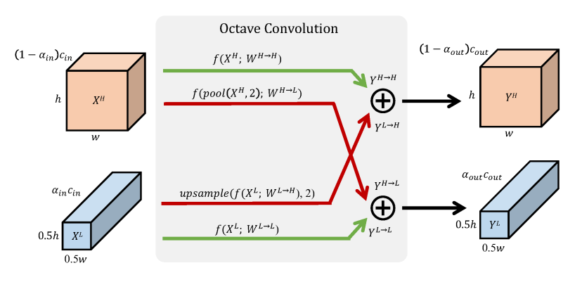

# Octave Convolution

[](https://travis-ci.org/braincreators/octconv)

Implementation of [Drop an Octave: Reducing Spatial Redundancy in
Convolutional Neural Networks with Octave Convolution](https://arxiv.org/pdf/1904.05049.pdf)



## Paper Abstract

In natural images, information is conveyed at different frequencies 
where higher frequencies are usually encoded with fine details and 
lower frequencies are usually encoded with global structures. 
Similarly, the output feature maps of a convolution layer can also be 
seen as a mixture of information at different frequencies. 
In this work, we propose to factorize the mixed feature maps by their 
frequencies, and design a novel Octave Convolution (OctConv) operation 
to store and process feature maps that vary spatially “slower” at a lower 
spatial resolution reducing both memory and computation cost. Unlike existing 
multi-scale methods, OctConv is formulated as a single, generic, plug-and-play 
convolutional unit that can be used as a direct replacement 
of (vanilla) convolutions without any adjustments in the network architecture. 
It is also orthogonal and complementary to methods that suggest better 
topologies or reduce channel-wise redundancy like group or depth-wise convolutions. 
We experimentally show that by simply replacing convolutions with OctConv, 
we can consistently boost accuracy for both image and video recognition tasks, 
while reducing memory and computational cost. 
An OctConv-equipped ResNet-152 can achieve 82.9% top-1 classification accuracy on
 ImageNet with merely 22.2 GFLOPs.


## Installation 

From PyPI:

    pip install octconv

Bleeding edge version from github:

    pip install git+https://github.com/braincreators/octconv.git#egg=octconv

## Usage

```python
import torch
from octconv import OctConv2d


# (batch, channels, height, width)
x = torch.rand(5, 3, 200, 200)

conv1 = OctConv2d(in_channels=3, out_channels=10, kernel_size=3, alpha=(0., 0.5), padding=1)
conv2 = OctConv2d(in_channels=10, out_channels=20, kernel_size=7, alpha=(0.5, 0.8), padding=3)
conv3 = OctConv2d(in_channels=20, out_channels=1, kernel_size=3, alpha=(0.8, 0.), padding=1)

out = conv3(conv2(conv1(x)))  # shape: (5, 1, 200, 200)
```

## Original implementation

 - [facebookresearch/OctConv (MXNET)](https://github.com/facebookresearch/OctConv)

## Citation

```
@article{chen2019drop,
  title={Drop an Octave: Reducing Spatial Redundancy in Convolutional Neural Networks with Octave Convolution},
  author={Chen, Yunpeng and Fan, Haoqi and Xu, Bing and Yan, Zhicheng and Kalantidis, Yannis and Rohrbach, Marcus and Yan, Shuicheng and Feng, Jiashi},
  journal={arXiv preprint arXiv:1904.05049},
  year={2019}
}
```
